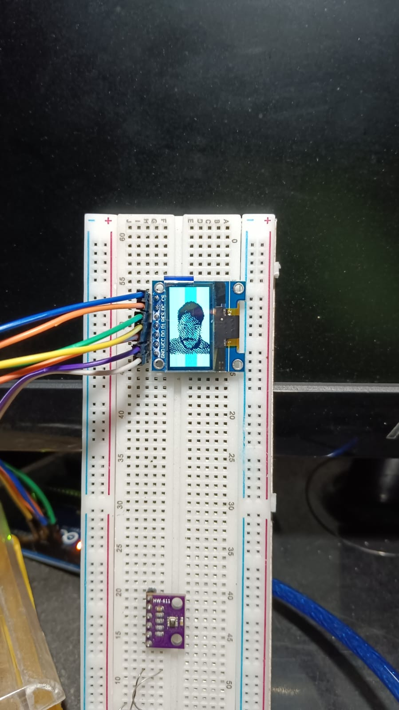

# OLED Display SPI Example with Arduino

This example demonstrates how to use an Adafruit SSD1306 OLED display with SPI interface using the Adafruit SSD1306 and Adafruit GFX libraries on an Arduino board. The project involves displaying a bitmap image on the OLED display.

## Libraries Required

- **Adafruit GFX**: A library for graphics functions.
- **Adafruit SSD1306**: A library to control SSD1306 OLED displays.

Install these libraries using the Arduino Library Manager or manually download and add them.

## Pin Configuration

The following pins are used for connecting the OLED display with the Arduino board via the SPI interface:

- **MOSI (Master Out Slave In)**: Pin 9
- **SCK (Serial Clock)**: Pin 10
- **DC (Data/Command)**: Pin 11
- **CS (Chip Select)**: Pin 12
- **RESET**: Pin 13

## OLED Display Setup

To initialize the OLED display using the Adafruit SSD1306 library, the following setup function is used:

```cpp
#define SCREEN_WIDTH 128
#define SCREEN_HEIGHT 64

Adafruit_SSD1306 display(SCREEN_WIDTH, SCREEN_HEIGHT, &SPI, OLED_DC, OLED_RESET, OLED_CS);

void setup() {
  if (!display.begin(SSD1306_SWITCHCAPVCC)) {
    Serial.println(F("SSD1306 allocation failed"));
    for (;;);
  }
  
  display.clearDisplay();
  display.display();
}
```

# Important Macros and Constants

- SCREEN_WIDTH: Width of the OLED screen (128 pixels).
- SCREEN_HEIGHT: Height of the OLED screen (64 pixels).
- SSD1306_SWITCHCAPVCC: Parameter to configure display's power supply.

# Drawing a Bitmap Image
- To draw a bitmap image, you need to convert your image into a byte array. You can use image conversion tools to generate the required byte array from the image.

# Example Code
```cpp
#include <SPI.h>
#include <Adafruit_GFX.h>
#include <Adafruit_SSD1306.h>

#define OLED_MOSI 9
#define OLED_CLK  10
#define OLED_DC   11
#define OLED_CS   12
#define OLED_RESET 13

#define SCREEN_WIDTH 128
#define SCREEN_HEIGHT 64

Adafruit_SSD1306 display(SCREEN_WIDTH, SCREEN_HEIGHT, &SPI, OLED_DC, OLED_RESET, OLED_CS);

const unsigned char myBitmap[] PROGMEM = {
  // Bitmap data generated from an image (binary representation)
};

void setup() {
  Serial.begin(115200);
  if (!display.begin(SSD1306_SWITCHCAPVCC)) {
    Serial.println(F("SSD1306 allocation failed"));
    for (;;);
  }
  
  display.clearDisplay();
  display.drawBitmap(0, 0, myBitmap, 128, 64, WHITE);
  display.display();
}

void loop() {
  // No need for additional code in the loop.
}
```

# Output Image:



# Explanation
- `display.drawBitmap(x, y, bitmap, w, h, color):` This function draws the bitmap on the screen at position (x, y) with a width w, height h, and color WHITE.
- `display.display():` Refreshes the display to show the bitmap.

# Removing I2C Functionality
If you do not need I2C communication, you can ignore or remove any references to I2C from your project. The code above focuses only on SPI for OLED communication.

# Notes
- Ensure the wiring is correctly done according to the SPI pin configuration.
- You can convert any image into a byte array using online tools such as <a href="https://javl.github.io/image2cpp/">image2cpp</a>.
- Make sure the power supply is appropriate for the OLED display.

# References
- <a href="https://github.com/adafruit/Adafruit-GFX-Library">Adafruit GFX Library</a>
- <a href="https://github.com/adafruit/Adafruit_SSD1306">Adafruit SSD1306 Library</a>
